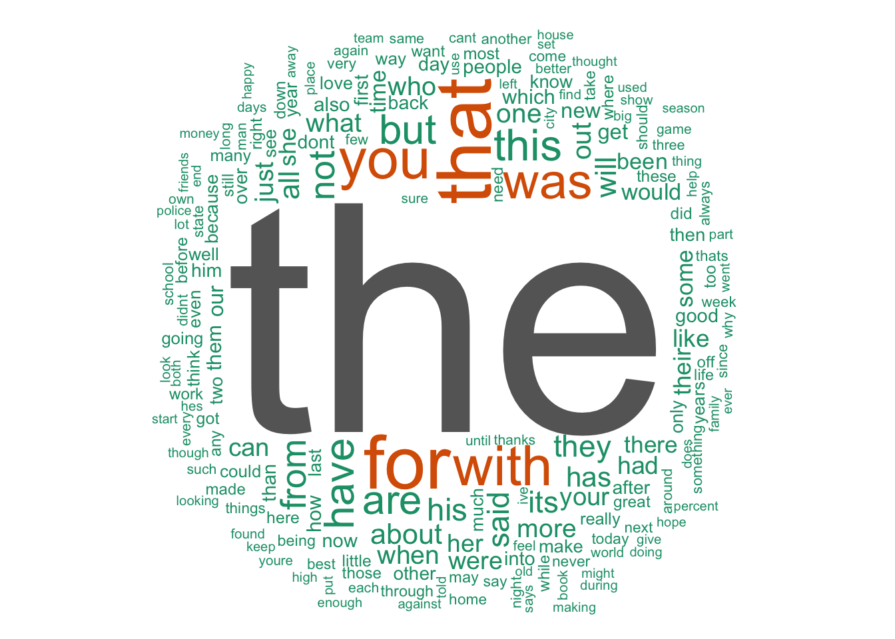

Coursera Data Science Capstone project
========================================================
author: Kelly Kurttila
date: 4/13/2016

Project goals:
========================================================

The goal for this project was to create a natural language predictor, using the shiny application process
that was:

- Efficient, quick
- Light on resources
- Good accuracy of prediction

The sources for the corpus used were Twitter, blogs, and news feeds available on the internet.

R was used for processing and data mining, and the data was broken down into a series of <a href="https://en.wikipedia.org/wiki/N-gram">n-grams</a> to speed up the prediction.

  A little about linguistics:
========================================================
left:40% 

</r>
</r>

***
</r>

The beautiful thing about language, even though we have so many words available to us, about 4000 words will cover 90% of what is being used, and many of those are the simple elements of language that join the words of interest, with "The" being at the top of the use list. My predictor starts with "the" when no entry has been made and it can quickly build from there.

The product:
========================================================

I made the product simple to use. The user can select the type of n-gram they would like to use, basically, how many words do you want to look at for predicting the next word, in sets of 2, 3, and 4. The next word is displayed below the entry. I also provided a combo choice that utilizized <a href="https://en.wikipedia.org/wiki/Katz%27s_back-off_model">Katz backoff model</a> for predicting as an additional option.

References: 
=======================================================
Instruction and education provided by John Hopkins University through Coursera, which made all of this possible: <a href="https://www.coursera.org/specializations/jhu-data-science">https://www.coursera.org/specializations/jhu-data-science</a>

Active vocabulary information: <a href="http://www.lingholic.com/how-many-words-do-i-need-to-know-the-955-rule-in-language-learning-part-2/">http://www.lingholic.com/how-many-words-do-i-need-to-know-the-955-rule-in-language-learning-part-2/</a>

Katz backoff model : <a href="https://en.wikipedia.org/wiki/Katz%27s_back-off_model">https://en.wikipedia.org/wiki/Katz%27s_back-off_model</a>
<a href="https://books.google.com/books?id=4v_Cx1wIMLkC&pg=PA36&lpg=PA36&dq=Some+words+are+more+frequent+than+others+-+what+are+the+distributions+of+word+frequencies?&source=bl&ots=5tysYg0k1h&sig=oH8L3_2BltR4aXH-6BijNL6n0HA&hl=en&sa=X&ved=0ahUKEwi0zMqLhM_LAhUN7GMKHZC5BpsQ6AEIPzAG#v=onepage&q=Some%20words%20are%20more%20frequent%20than%20others%20-%20what%20are%20the%20distributions%20of%20word%20frequencies%3F&f=false">Statistical Machine Translation</a> by Philipp Koehn

Ngram tokenizer <a href="https://books.google.com/books?id=hO7sBQAAQBAJ&pg=PA306&lpg=PA306&dq=function(x)+NGramTokenizer(x,+Weka_control(min+%3D+1,+max+%3D1))&source=bl&ots=BIOg9y39P7&sig=EOKSSdDkisIePL_HoZmmA_DNcMg&hl=en&sa=X&ved=0ahUKEwi-jJKA68_LAhVW22MKHdV2CoU4ChDoAQghMAE#v=onepage&q=function(x)%20NGramTokenizer(x%2C%20Weka_control(min%20%3D%201%2C%20max%20%3D1))&f=false">Automated Data Collection with R</a> ebook by Simon Munzert, Christian Rubba, Peter MeiBner

The complete code source: 
